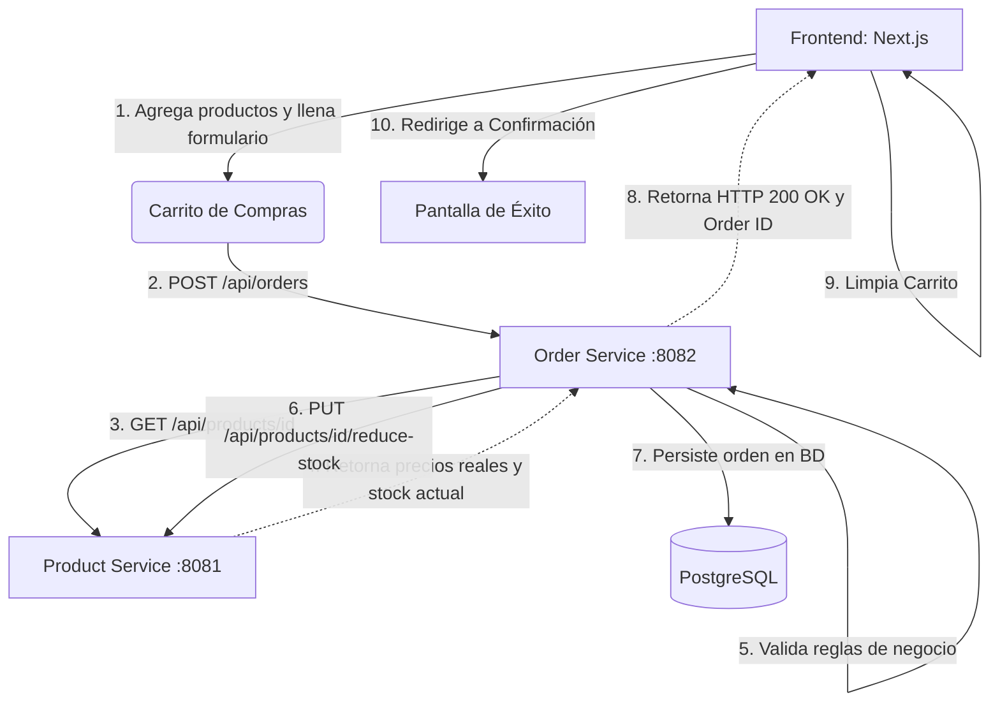

# 🐟 FishWish E-Commerce

 *(Agrega aquí una imagen o logo del proyecto)*

**FishWish** es una plataforma de e-commerce desarrollada como proyecto universitario para las asignaturas de **Sistemas Distribuidos** y **Taller de Emprendedores** (Universidad Autónoma de Campeche).

El proyecto propone un modelo de economía circular enfocado en la elaboración y venta de snacks naturales deshidratados para mascotas, aprovechando los subproductos pesqueros de las costas de Campeche. Esto no solo brinda nutrición de alta calidad sin conservadores, sino que reduce el impacto ambiental en los muelles y apoya la economía de los pescadores locales.

---

## 🚀 Tecnologías Utilizadas

Este proyecto utiliza una arquitectura moderna basada en un **Monorepo** y **Microservicios**, separando claramente la responsabilidad de presentación y de negocio.

### Frontend
* **[Next.js 16](https://nextjs.org/)** (React Framework - App Router)
* **TypeScript** (Tipado estricto)
* **Tailwind CSS** (Estilos y diseño UI)
* **Zustand** (Manejo de estado global persistente para el carrito)
* **Sonner** (Sistema moderno de notificaciones toast)

### Backend (Microservicios)
* **[Spring Boot 3.3](https://spring.io/projects/spring-boot)**
* **Java 21**
* **Spring Data JPA** (Hibernate)
* **PostgreSQL 16** (Persistencia de datos)
* **RestTemplate** (Comunicación síncrona entre microservicios)

### Infraestructura y Herramientas
* **[Turborepo](https://turbo.build/)** (Gestor de monorepo de alto rendimiento)
* **Docker & Docker Compose** (Containerización de bases de datos y servicios auxiliares)
* **pnpm** (Gestor de paquetes rápido y eficiente)

---

## 🏗 Arquitectura de Microservicios

El backend sigue un patrón estricto de microservicios distribuidos:

1. **`product-service` (Puerto 8081):** Gestiona el inventario, los precios reales y los detalles de los productos.
2. **`order-service` (Puerto 8082):** Orquesta la creación de pedidos. Se comunica de forma síncrona con el `product-service` para verificar stock, asegurar la inmutabilidad de los precios desde el backend (evitando manipulaciones del frontend) y descontar el inventario al concretar una venta.
3. **Database:** PostgeSQL orquestado vía Docker.

---

## ⚙️ Requisitos del Sistema

Para ejecutar este proyecto en tu entorno local, asegúrate de tener instalado:

* [Node.js](https://nodejs.org/en/) (v18 o superior)
* [pnpm](https://pnpm.io/) (`npm install -g pnpm`)
* [Java JDK 21](https://adoptium.net/)
* [Maven](https://maven.apache.org/) (o usar el wrapper incluido)
* [Docker Desktop](https://www.docker.com/products/docker-desktop/) (Para levantar la base de datos)

---

## 🛠 Cómo Ejecutar el Proyecto

Sigue estos pasos cuidadosamente para levantar todo el sistema distribuido.

### 1. Clonar e Instalar Dependencias Frontend
```bash
git clone https://github.com/tu-usuario/fishwish-ecommerce.git
cd fishwish-ecommerce
pnpm install
```

### 2. Levantar la Infraestructura (Base de Datos)
Asegúrate de tener Docker abierto y ejecuta:
```bash
cd docker
docker-compose up -d postgres
```
*Esto levantará una instancia de PostgreSQL en el puerto `5433`.*

### 3. Levantar los Microservicios (Backend)
Debes levantar ambos servicios en terminales independientes:

**Terminal 1 (Product Service):**
```bash
cd apps/product-service
mvn spring-boot:run
```

**Terminal 2 (Order Service):**
```bash
cd apps/order-service
mvn spring-boot:run
```

### 4. Levantar el Frontend (Next.js)
En una tercera terminal, en la raíz del proyecto:
```bash
pnpm dev
```
La aplicación web estará disponible en [http://localhost:3000](http://localhost:3000).

---

## 🛒 Flujo de Compra Distribuido


*(Si usas un editor compatible con Mermaid en GitHub o VSCode, verás un diagrama de flujo interactivo).*

---

## 📁 Estructura del Monorepo

```text
fishwish-ecommerce/
├── apps/
│   ├── web/                # Frontend (Next.js 16 App Router)
│   ├── product-service/    # Microservicio Java (Manejo de inventario)
│   └── order-service/      # Microservicio Java (Orquestación de compras)
├── docker/
│   └── docker-compose.yml  # Definición de infraestructura
├── packages/
│   ├── eslint-config/      # Reglas compartidas de linter
│   ├── typescript-config/  # Reglas compartidas de TS
│   └── ui/                 # Componentes UI compartidos (Si aplica)
├── package.json            
└── turbo.json              # Configuración de Turborepo
```

---

## 📸 Capturas de Pantalla

*(Agrega aquí screenshots de tu aplicación funcionando, creando una carpeta `docs` en la raíz del proyecto y guardando ahí las imágenes)*

| Página Principal | Catálogo de Productos |
| :---: | :---: |
|  |  |

| Carrito de Compras | Checkout y Confirmación |
| :---: | :---: |
|  |  |

---

## 🎓 Equipo y Universidad

**Universidad Autónoma de Campeche (UACAM)**
Proyecto desarrollado para evaluar los conocimientos prácticos en:
- **Sistemas Distribuidos** (Arquitectura, Microservicios, Comunicación REST)
- **Taller de Emprendedores** (Economía Circular, Modelo de Negocio, Impacto Ambiental)

**Integrantes:**
- [Tu Nombre/Apellidos] - *Rol principal (ej. Full Stack Developer)*
- [Nombre Integrante 2] - *Rol*
- [Nombre Integrante 3] - *Rol*

**Fecha:** Abril 2026

---
*“Salud en cada mordida. Por mascotas sanas y costas limpias.”* 🐟